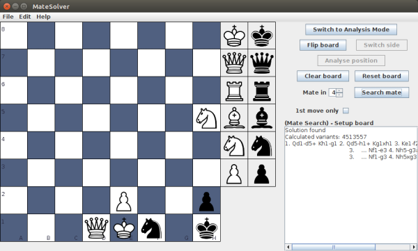
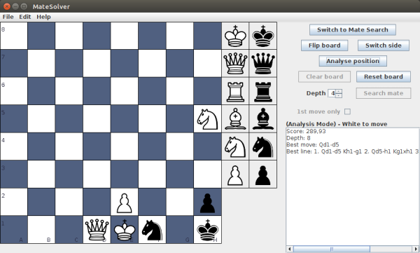

<h1>MateSolverDesktop</h1>
Deutsch weiter unten! 

 

A chess application to solve mate puzzles by brute force algorithm (checking all possible moves...)
and to analyse chess positions or chess games. There is a built-in engine to evaluate scores
for a chess position. It is not intended to be your opponent. There are better apps and engines. 
Within the application you can copy pictures of the board or the move list to clipboard and export
a game to PDF to document chess matches or chess problems with your computer. 
You can build it with NetBeans or find a JAR-file in the dist folder. 
 
 
<h1>MateSolverDesktop</h1>

 

Eine Schachanwendung zum Lösen von Schachproblemen durch Bruteforce (Prüfen aller möglichen Züge...)
und zum Analysieren von Schachpositionen oder Schachpartien. Es gibt eine integrierte Engine zum
Berechnen des Wertes einer Schachposition. Sie ist nicht als Gegner für Sie gedacht. Es
gibt bessere Anwendungen und Engines. 
Innerhalb der Anwendung können Sie Bilder des aktuellen Bretts oder die Zugliste in die Zwischenablage
kopieren und den aktuellen Stand in eine PDF-Datei exportieren, um Partien oder Probleme mit
Ihrem Computer zu dokumentieren. 
Sie können die Anwendung mit NetBeans übersetzen, oder aber eine JAR-Datei im dist-Ordner finden. 

